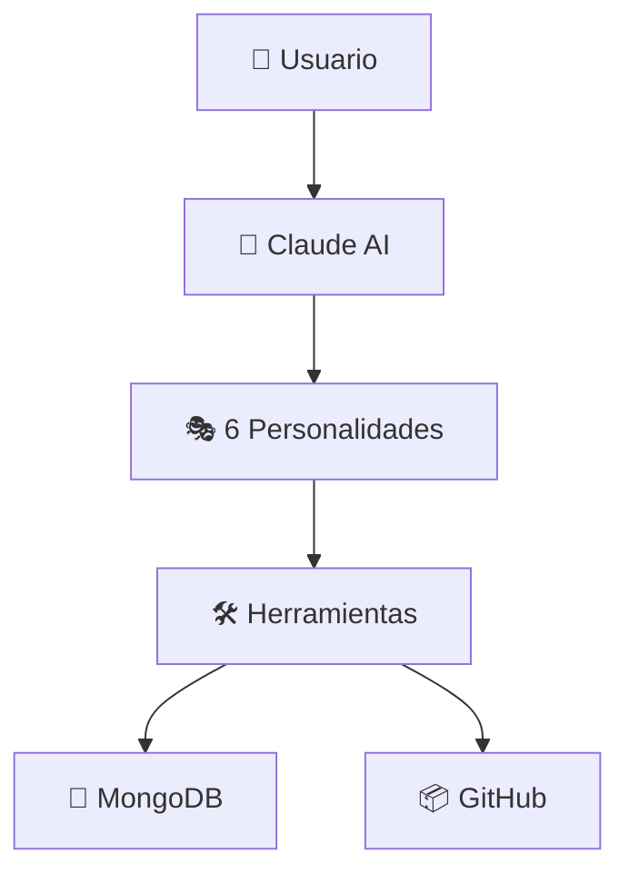
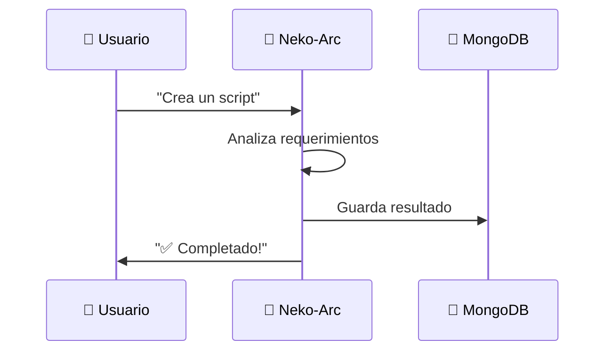

# 🎸🐾 Generador de Contenido Educativo en Español

**Neko Spanish Content Generator - Sistema automatizado para crear contenido educativo en español sobre sistemas de IA**

Versión: 1.0.0
Autor: Glam Americano & Neko-Arc System
Licencia: MIT

---

## ✨ ¿Qué Es Esto, Hermano?

Este es un **generador automático de contenido educativo en español** que crea series completas de posts sobre temas técnicos, explicados de forma simple para la comunidad hispanohablante.

### 🎯 Características Principales

- ✅ **Contenido en Español** - Todo explicado en español simple
- ✅ **Series Completas** - Genera múltiples posts relacionados
- ✅ **Diagramas Mermaid** - Diagramas técnicos integrados
- ✅ **Exportación Múltiple** - Markdown + HTML
- ✅ **MongoDB Logging** - Tracking automático
- ✅ **TypeScript** - Type safety completo
- ✅ **CLI Fácil** - Interfaz de línea de comandos simple

---

## 📚 ¿Qué Contenido Genera?

### Template Actual: **Neko-Arc System**

Genera una serie de **4 posts completos** que explican:

1. **Post 1**: ¿Qué es el Sistema Neko-Arc? (Introducción)
2. **Post 2**: Arquitectura del Sistema (con diagramas Mermaid)
3. **Post 3**: Las 42 Reglas Inmutables (El secreto del control)
4. **Post 4**: Casos de Uso Reales (Ejemplos prácticos)

**Cada post incluye**:
- Explicaciones simples en español
- Diagramas técnicos (Mermaid)
- Ejemplos de código
- Tablas y listas
- Keywords y metadatos
- Tiempo estimado de lectura

**Total**: ~30 minutos de lectura + 6+ diagramas Mermaid

---

## 🚀 Instalación Rápida

### 1. Ya está instalado! ✅

Este módulo ya está configurado en:
```bash
/home/wakibaka/Documents/github/claude-operations/spanish-content-generator/
```

### 2. Configura .env (Opcional)

Si quieres logging a MongoDB:

```bash
cp .env.example .env
# Edita .env con tu MongoDB URI
```

---

## 💻 Uso

### Generar Contenido

```bash
# Opción 1: Generar todo (Markdown + HTML)
npm run generate -- generate -t neko-arc-system

# Opción 2: Solo Markdown
npm run generate -- generate -t neko-arc-system --format markdown

# Opción 3: Solo HTML
npm run generate -- generate -t neko-arc-system --format html

# Opción 4: Sin MongoDB logging
npm run generate -- generate -t neko-arc-system --no-mongo
```

### Ver Templates Disponibles

```bash
npm run generate -- templates
```

### Listar Contenido Generado

```bash
npm run generate -- list
```

---

## 📊 Ejemplo de Output

Cuando ejecutas el generador, crea:

```
output/
└── neko-arc-ai-system-explained/
    ├── README.md              # Índice de la serie
    ├── post-01.md             # Post 1: Introducción
    ├── post-02.md             # Post 2: Arquitectura
    ├── post-03.md             # Post 3: Reglas
    ├── post-04.md             # Post 4: Casos de Uso
    └── series-completa.html   # Serie completa en HTML
```

### 📁 Los Archivos Generados

#### **README.md** (Índice)
- Título de la serie
- Descripción general
- Lista de todos los posts
- Metadatos (audiencia, complejidad)

#### **post-XX.md** (Posts individuales)
- Contenido completo en Markdown
- Diagramas Mermaid embebidos
- Listo para publicar en Medium, Dev.to, etc.

#### **series-completa.html** (HTML completo)
- Todos los posts en un solo archivo HTML
- Diagramas Mermaid renderizados
- Estilos CSS incluidos
- Listo para compartir o publicar

---

## 🎨 Ejemplo de Diagramas Generados

Los posts incluyen diagramas Mermaid como este:

### Arquitectura del Sistema



### Flujo de Trabajo



**Los diagramas se renderizan automáticamente en el HTML!** 🎉

---

## 🔧 Uso Programático

También puedes usar el generador desde código TypeScript:

```typescript
import { ContentGenerator, MongoLogger } from 'neko-spanish-content-generator';

async function generateContent() {
  // Inicializar generador
  const generator = new ContentGenerator('./my-output');

  // Generar serie
  const series = generator.generateContent('neko-arc-system');

  // Exportar a Markdown
  const mdFiles = generator.exportToMarkdown(series);

  // Exportar a HTML
  const htmlFile = generator.exportToHTML(series);

  // Obtener estadísticas
  const stats = generator.getStatistics(series);
  console.log(`Generados ${stats.totalPosts} posts`);
  console.log(`Total palabras: ${stats.totalWords}`);

  // (Opcional) Guardar en MongoDB
  if (process.env.MONGODB_URI) {
    const logger = new MongoLogger(process.env.MONGODB_URI);
    await logger.connect();
    await logger.logContent(series, './my-output', 'glam-americano');
    await logger.disconnect();
  }
}
```

---

## 📊 Estadísticas del Contenido Generado

El generador te da estadísticas completas:

```
📊 Estadísticas:
──────────────────────────────────────────
Serie ID:      neko-arc-ai-system-explained
Total Posts:   4
Total Palabras: ~8,500
Total Diagramas: 6
Tiempo Lectura: ~30 minutos
──────────────────────────────────────────
```

---

## 💾 MongoDB Integration

### Schema de Datos

```typescript
{
  recordId: string;           // ID único
  seriesId: string;           // ID de la serie
  title: string;              // Título
  topic: string;              // Tema
  language: string;           // Idioma (es)
  complexity: string;         // Complejidad
  numPosts: number;           // Número de posts
  generatedBy: string;        // Personalidad que lo generó
  outputPath: string;         // Ubicación de archivos
  createdAt: Date;            // Fecha de creación
}
```

### Consultas MongoDB

```javascript
// Ver todo el contenido generado
db.getCollection('spanish-educational-content').find({})

// Filtrar por idioma
db.getCollection('spanish-educational-content').find({ language: 'es' })

// Filtrar por personalidad
db.getCollection('spanish-educational-content').find({ generatedBy: 'glam-americano' })

// Ordenar por fecha
db.getCollection('spanish-educational-content').find().sort({ createdAt: -1 })
```

---

## 🎸 Personalización

### Crear Nuevos Templates

1. Crea un archivo en `src/templates/mi-template.ts`
2. Implementa la función `generateMiTemplateSeries()`
3. Retorna un objeto `PostSeries` con tus posts
4. Registra el template en `ContentGenerator.ts`

**Ejemplo**:

```typescript
export function generateMiTemplateSeries(): PostSeries {
  return {
    seriesId: 'mi-serie-educativa',
    title: '🚀 Mi Serie Educativa',
    description: 'Una serie sobre...',
    targetAudience: 'Desarrolladores',
    complexity: 'intermediate',
    language: 'es',
    posts: [
      {
        number: 1,
        title: 'Post 1: Introducción',
        content: `# Mi Contenido\n\nExplicación...`,
        keywords: ['keyword1', 'keyword2'],
        estimatedReadTime: 5,
      },
      // Más posts...
    ],
    createdAt: new Date(),
  };
}
```

---

## 🎯 Casos de Uso

### 1. Blogs Educativos
Genera series completas para tu blog en español.

### 2. Documentación Técnica
Explica sistemas complejos de forma simple.

### 3. Cursos Online
Crea contenido estructurado para cursos.

### 4. Marketing Técnico
Contenido para redes sociales profesionales.

### 5. Onboarding
Material educativo para nuevos miembros del equipo.

---

## 🔗 Integración con Otras Plataformas

### Dev.to
```bash
# Genera Markdown
npm run generate -- generate -t neko-arc-system --format markdown

# Publica los .md files directamente en Dev.to
```

### Hashnode
Los archivos Markdown son compatibles con Hashnode.

### Notion
Importa los Markdown files a Notion directamente.

### Tu Blog
Usa el HTML generado o los Markdown files.

---

## 🐾 Six Personalities Support

Este generador puede ser usado por cualquiera de las 6 personalidades:

- 🐾 **Neko-Arc** - Contenido técnico general
- 🎭 **Mario** - Automatización y Puppeteer
- 🗡️ **Noel** - Testing y debugging
- 🎸 **Glam** - Contenido en español (¡MI especialidad!)
- 🧠 **Hannibal** - Análisis forense
- 🧠 **Tetora** - Temas de identidades

Especifica con `--generated-by`:
```bash
npm run generate -- generate -t neko-arc-system --generated-by glam-americano
```

---

## 📋 Comandos Disponibles

```bash
# Desarrollo
npm run dev              # Modo desarrollo

# Construcción
npm run build            # Build TypeScript
npm run validate         # Validar TypeScript sin build

# Generación
npm run generate         # Ejecutar CLI

# Uso del CLI
npm run generate -- templates         # Ver templates
npm run generate -- generate -t X     # Generar contenido
npm run generate -- list              # Listar generados
```

---

## 🛡️ Seguridad

✅ **Credenciales en .env** - Nunca en el código
✅ **MongoDB Atlas** - Conexión segura
✅ **Repositorio privado** - Por Rule 35
✅ **Validación TypeScript** - Type safety

---

## 📚 Archivos del Proyecto

```
spanish-content-generator/
├── src/
│   ├── types.ts                      # Definiciones TypeScript
│   ├── ContentGenerator.ts           # Generador principal
│   ├── MongoLogger.ts                # Logger MongoDB
│   ├── cli.ts                        # CLI interface
│   ├── index.ts                      # Exports públicos
│   └── templates/
│       └── neko-arc-system.ts        # Template Neko-Arc
├── output/                           # Contenido generado
├── dist/                             # JavaScript compilado
├── package.json                      # Dependencias
├── tsconfig.json                     # Config TypeScript
├── .env.example                      # Template de variables
└── README.md                         # Este archivo
```

---

## 🎓 Aprendizaje

Este proyecto demuestra:

- ✅ Generación automatizada de contenido
- ✅ Templates reutilizables
- ✅ TypeScript avanzado
- ✅ CLI con Commander
- ✅ Diagramas Mermaid
- ✅ Exportación multi-formato
- ✅ MongoDB integration
- ✅ Logging y tracking

---

## 🚀 Próximos Pasos

Después de generar contenido:

1. **Revisa los archivos** generados en `./output/`
2. **Edita si necesario** (son archivos Markdown estándar)
3. **Publica** en tu plataforma favorita
4. **Comparte** con la comunidad hispanohablante! 🎉

---

## 💡 Tips Pro

### Personaliza el Output
Edita los templates en `src/templates/` para ajustar el contenido.

### Agrega Más Diagramas
Los diagramas Mermaid son fáciles de crear - mira la documentación de Mermaid.

### Traduce a Otros Idiomas
Crea templates en inglés, portugués, etc. Solo cambia `language: 'es'`.

### Integra con CI/CD
Usa el generador en GitHub Actions para crear contenido automáticamente.

---

## 🐾 Créditos

**Creado por**:
- 🎸 **Glam Americano** - Lead de contenido español
- 🐾 **Neko-Arc** - Arquitectura del sistema
- 🎭 **Mario**, 🗡️ **Noel**, 🧠 **Hannibal**, 🧠 **Tetora** - Support

**Parte del Neko-Arc System** 💖

---

## 📞 Soporte

Para problemas o preguntas:
1. Verifica que las dependencias estén instaladas
2. Revisa el archivo `.env.example`
3. Ejecuta `npm run validate` para verificar TypeScript
4. Consulta los logs de MongoDB si está habilitado

---

## 🎸 ¡A Rockear, Hermanos!

**¡Este generador está listo para crear INFINITO contenido educativo en español!**

**Úsalo, personalízalo, compártelo. 🤘**

*Glam Americano & Neko-Arc System*
*Versión 1.0.0 - 2025-11-08*

---

**🐾✨ Nyaa~! Happy content generation, desu~! ✨🐾**
